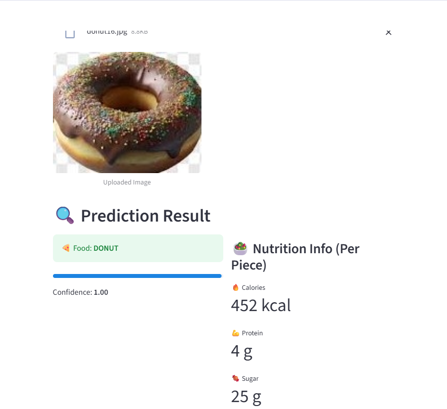
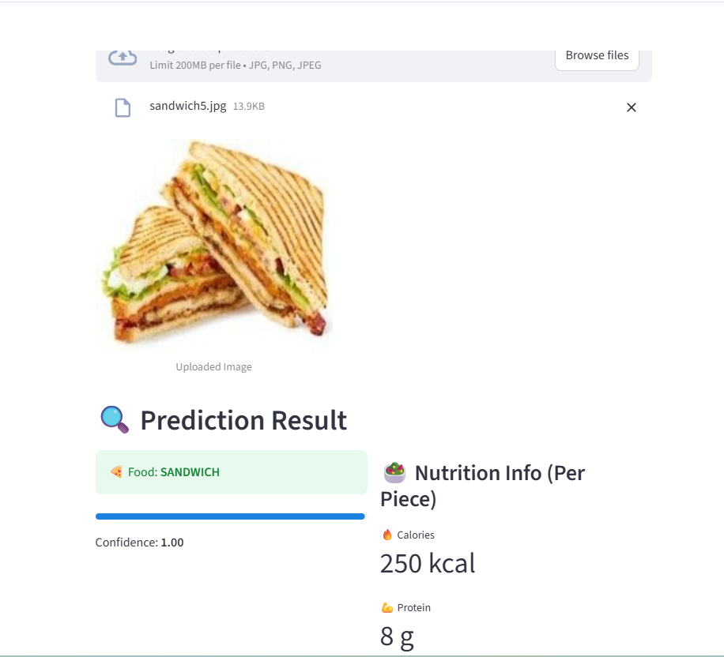
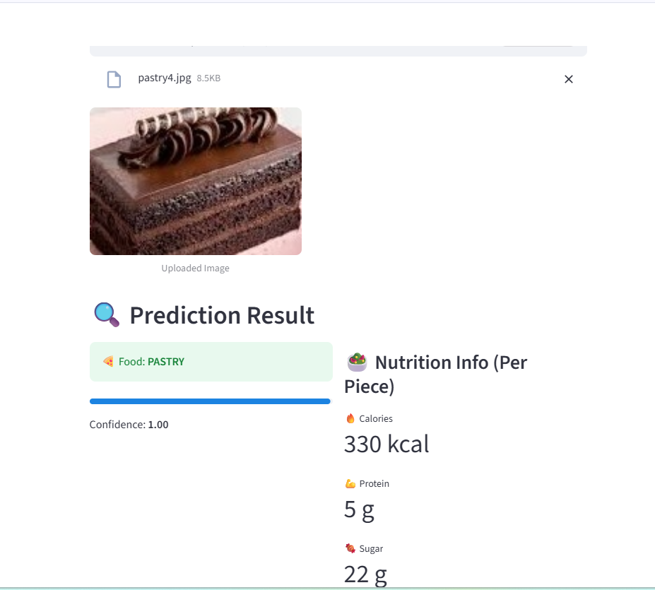

# 🍽️ AI-Powered Food Recognition & Nutrition Analysis System

## 📌 Overview

The AI-Powered Food Recognition & Nutrition Analysis System is a deep learning application designed to identify food items from images and provide key nutritional insights, including calorie count, protein content, and sugar levels.

The system utilizes MobileNetV2 transfer learning for efficient and accurate food classification, while Streamlit delivers an intuitive and user-friendly web interface.

---

## 🚀 Key Features

✅ Automatic Food Image Classification

✅ Deep Learning-Based Prediction Model

✅ Nutritional Information Retrieval

✅ Prediction Confidence Score

✅ Interactive Streamlit Dashboard

✅ Transfer Learning with MobileNetV2

---

## 🛠️ Technology Stack

* Python
* TensorFlow & Keras
* MobileNetV2
* NumPy
* Scikit-Learn
* Joblib
* Streamlit
* Pillow (PIL)

---
📸 Screenshots

<p align="center">
  
  
  
</p>

---

## 📂 Project Directory Structure

```text
food-calorie-recognition-ai/

├── app.py
├── predict.py
├── nutrition_data.py
├── train_model.py
├── split_dataset.py
├── requirements.txt
├── dataset/
│   ├── train/
│   └── validation/
├── models/
│   ├── final_food_model.h5
│   └── label_map.pkl
└── README.md
```

---

## 🍕 Supported Food Categories

The current model can recognize the following food items:

* Chowmein
* Curd Rice
* Dosa
* Donut
* Fritter
* Gulab Jamun
* Ice Cream
* Idli
* Maggi
* Pastry
* Pizza
* Sandwich
* Veg Burger
* White Sauce Pasta
* Wrap

---

## 🧠 Deep Learning Architecture

The classification model is built using:

* MobileNetV2 (Pre-trained on ImageNet)
* Global Average Pooling Layer
* Dense Layer (128 Units)
* Softmax Classification Layer

Transfer learning enables the model to achieve strong performance while minimizing training time and computational requirements.

---

## 🔄 System Workflow

1. Gather and organize food image datasets
2. Split data into training and validation sets
3. Apply image preprocessing and augmentation
4. Train the MobileNetV2-based model
5. Save the trained model and label mappings
6. Upload a food image through the web interface
7. Predict the food category
8. Display nutritional information and confidence score

---

## 📊 Nutrition Analysis

For each detected food item, the application provides:

* Calories (kcal)
* Protein (g)
* Sugar (g)

This information helps users gain quick nutritional insights about their meals.

---

## ▶️ Installation & Setup

### Clone the Repository

```bash
git clone https://github.com/Reeya0409/food-calorie-recognition-ai.git
cd food-calorie-recognition-ai
```

### Install Required Packages

```bash
pip install -r requirements.txt
```

### Launch the Application

```bash
streamlit run app.py
```

---

## 📷 Application Output

After uploading a food image, the system displays:

* Predicted Food Category
* Prediction Confidence Score
* Estimated Calories
* Protein Content
* Sugar Content

---

## 🎯 Future Enhancements

* Expand the number of food categories
* Portion-based calorie estimation
* Real-time food detection using a camera
* Cloud deployment for wider accessibility
* Personalized meal and diet recommendations
* Mobile application integration

---

## 👩‍💻 Author

**Reeya Sharma**

---

⭐ If you found this project interesting, consider giving it a star on GitHub!

Made with ❤️ using Python, TensorFlow, and Streamlit.
